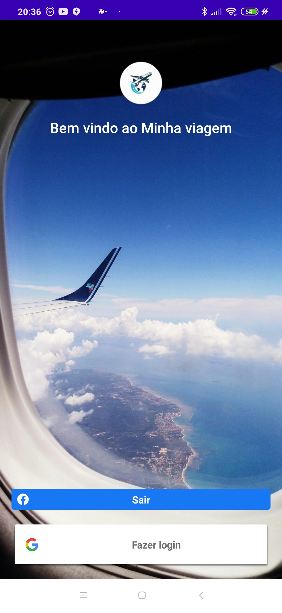
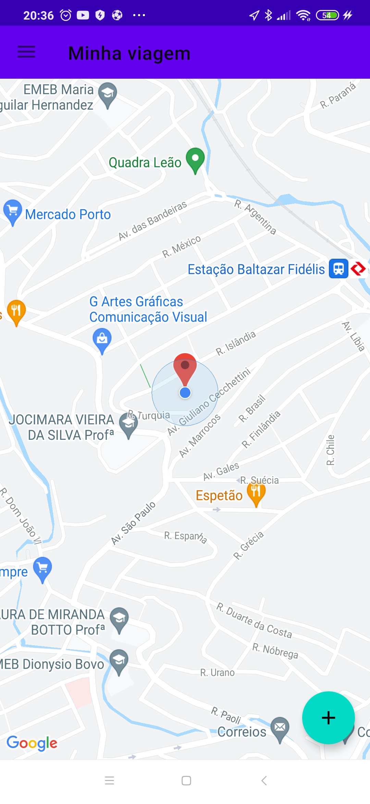
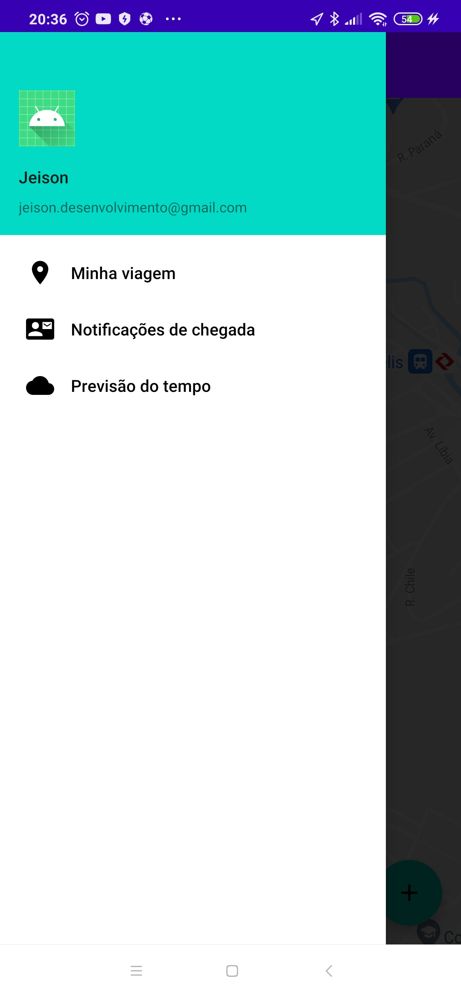
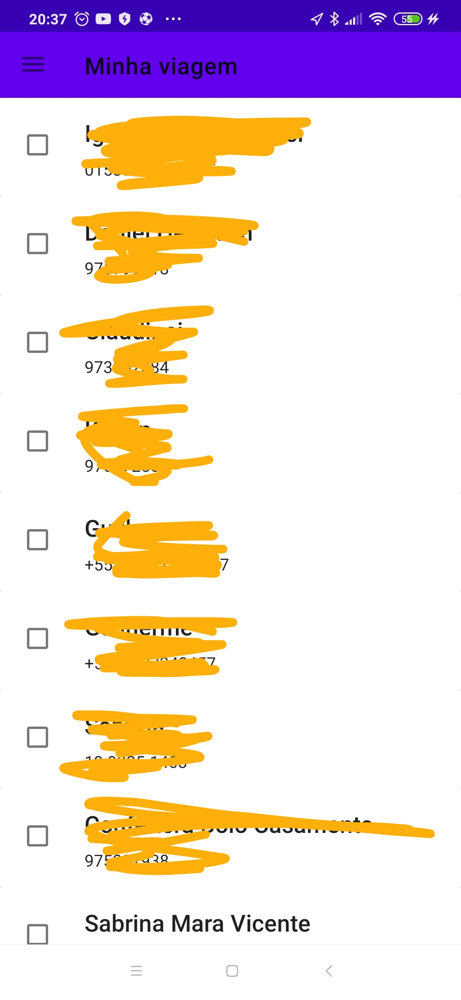
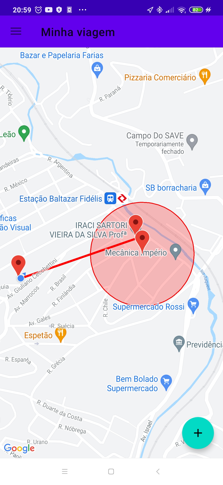

# Projeto MinhaViagem
Projeto para conclusão de curso da Nextu. Este tem como objetivo avaliar a utilização de sensores do celular, serviços da google como Mapas, Geofences, Places API em um projeto voltado para área de viagens.

## Objetivo do aplicativo

Este aplicativo permite que o usuário se localize e determine um local de desembarque. Para apoio ao desembarque há possibilidade de incluir uma área de notificação e determinar quais contatos poderão receber essa notificação.

Apresentação|Login|Minha Localização| Funcionalidades|Notificações|Notificações|Area de notificações|
:----------:|:----------:|:----------:|:----------:|:----------:|:----------:|:----------:|
|| ||||